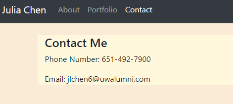
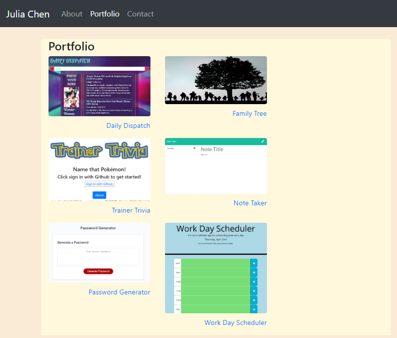

# Responsive Portfolio
Created a responsive portfolio site using Bootstrap tools

All pages have a responsive navbar at the top that links to the other pages, as well as a footer that stays at the bottom of the page.

## Index
Main landing page. Contains an about section with a profile image.

Responsive Design:
* On Larger screens, the text wraps around the profile image
* On smaller screens, the profile image takes up its own row.

## Contact
Contains contact information if the use wishes to contact me.

## Portfolio
Has images that link to other projects I've done on GitHub

  * The first image links to the CodeRefactor project, while the other one links right to this Portfolio
  * The other two images are placeholders.

Responsive Design:
  * On larger screens, there are two images per row
  * On smaller screens, each image takes up its own row.
